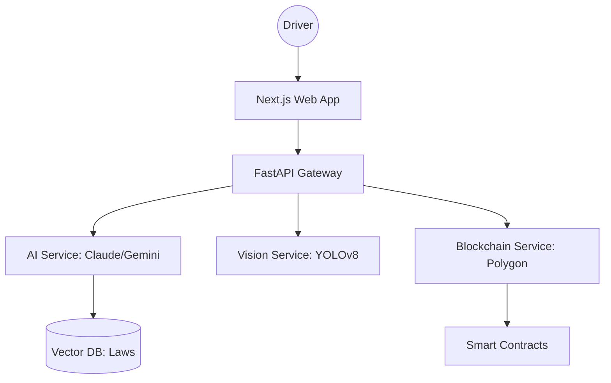

# 🚗 DriveLegal — AI-Powered Traffic Law Assistant

> **Road Safety Hackathon 2026** | CoERS, RBG Labs, IIT Madras  
> **Theme**: AI in Road Safety — Bridging the Gap between Law and the Driver

---

## 🧭 The Challenge
Every year, millions of drivers face traffic violations without clearly understanding the legal implications, fine structures, or their right to appeal. Information is often buried in complex legal documents or varies drastically across state borders, leading to confusion, bribery, and unsafe road behavior.

## 💡 Our Solution: DriveLegal
**DriveLegal** is a comprehensive, AI-driven ecosystem designed to make traffic laws accessible, transparent, and immutable. It combines LLM-powered legal assistance, Computer Vision for sign recognition, and Blockchain for tamper-proof violation records.

---

## 🌟 Key Features

### 🤖 1. AI Legal Assistant (RAG-Powered)
- **Context-Aware Q&A**: Trained on national and state-specific traffic law databases.
- **Multi-Lingual Support**: Communicate in 20+ regional languages.
- **Document OCR**: Upload a citation/ticket to instantly extract violation details and legal implications.

### 🔗 2. Blockchain Violation Registry
- **Transparency**: Records violations on the **Polygon Blockchain** to prevent tampering or data manipulation.
- **Smart Escrow**: Secure, transparent fine payment handling via smart contracts.
- **Driver History**: Immutable record of a driver's safety compliance over time.

### 👁️ 3. Computer Vision & Safety
- **Sign Recognition**: Real-time traffic sign detection using **YOLOv8**.
- **Speed Limit Alerts**: Extracts speed limits from road signs via OCR to alert drivers in real-time.
- **Vehicle Analytics**: Analyzes vehicle condition for safety compliance.

### 🏆 4. Safety Gamification
- **Driver Badges**: Earn rewards for "Clean Records" and "Safe Driving Streaks."
- **Insurance Integration**: High safety scores unlock exclusive insurance discounts from partners.

---

## 🛠️ Tech Stack

| Layer          | Technology                                   |
|----------------|----------------------------------------------|
| **Frontend**   | Next.js 14, Tailwind CSS, TypeScript        |
| **Backend**    | FastAPI (Python 3.11), SQLAlchemy           |
| **AI / LLM**   | Anthropic Claude-3 / Google Gemini 1.5 Pro  |
| **Vector DB**  | LlamaIndex + ChromaDB (for RAG)             |
| **Blockchain** | Solidity, Hardhat, Polygon Network          |
| **Vision**     | OpenCV, YOLOv8, Ultralytics                 |
| **Geospatial** | Google Maps API, IPInfo Geolocation        |

---

## 📂 Architecture Overview



---

## 🚀 Quick Setup

1. **Clone & Install**
   ```bash
   git clone https://github.com/ani505/drivelegal
   cd drivelegal/backend
   pip install -r requirements.txt
   ```

2. **Environment Configuration**
   Edit the `.env` file with your API keys (Anthropic, Gemini, Google Maps).

3. **Launch**
   ```bash
   # Backend
   uvicorn app.main:app --reload
   
   # Frontend
   cd ../frontend
   npm install && npm run dev
   ```

---

## 👥 Team & Credits

- **Frontend Development & UI/UX**: Srijoni Ghosh
- **Backend Development & AI Integration**: Aniruddh Viswarajan

---

## 🏆 Innovation Impact
DriveLegal reduces the friction between law enforcement and citizens. By providing instant legal clarity and incentivizing safe behavior through gamification and blockchain transparency, we aim to reduce road violations by **30%** and increase public trust in traffic management systems.

---
Built with ❤️ for the **Road Safety Hackathon 2026** — IIT Madras
